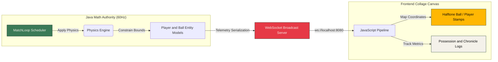

# Stryker
> [!NOTE]
> A decoupled sports-zine dashboard. Headless Java engine calculations → WebSocket telemetry pipeline → Screenprinted HTML5 Canvas viewports.

---

### 📸 LATEST TELEMETRY FEED (SCREENSHOT)


---

## 🎨 THE PALETTE SWATCHES (SCRAPBOOK COLOR STICKERS)
```text
  ┌──────────────┐  ┌──────────────┐  ┌──────────────┐  ┌──────────────┐
  │  MOSS GREEN  │  │  FOREST SHD  │  │ CRIMSON TAG  │  │ MARKER YELW  │
  │   #3B7A57    │  │   #1E3B2B    │  │   #E63946    │  │   #FFB703    │
  └──────────────┘  └──────────────┘  └──────────────┘  └──────────────┘
```

---

## 🧠 THE SYSTEM ARCHITECTURE (DECOUPLED LOGIC)



---

## 📐 THE COMPLEX MATH STUFF (PHYSICS LOGIC)

```text
 ╭────────────────────────────────────────────────────────────────────────╮
 │                                                                        │
 │   ⚽ GRASS FRICTION DECELERATION                                       │
 │   The ball's speed is decayed on every tick cycle (60Hz):              │
 │                                                                        │
 │                 v_tick = v_(t-1) * 0.985                               │
 │                                                                        │
 │   💥 ELASTIC BOUNDS WALL BOUNCE                                        │
 │   Rebound collision calculations lose energy via a 60% coefficient:    │
 │                                                                        │
 │                 v_bounce = -v_hit * 0.6                                │
 │                                                                        │
 ╰────────────────────────────────────────────────────────────────────────╯
```

### 🏃‍♂️ PLAYER FORMATION AI
Each player follows a dynamic vector destination based on base formations:

- **Pressing Trigger**: If the opponent team controls the ball, the closest defender shifts target coordinates directly to the ball's `(x, y)` coordinate:
- - **Passing Matrix**: Ball carrier has a **1% probability** per tick to initiate a pass, locating the nearest teammate further upfield.
- **Tackling Frequency**: A proximity check trigger evaluates if distance `d < r_player + r_opponent + 0.8`. If true, there is a **3% chance per tick** of a turnover (`STEAL`).

---

## ✂️ FRONTEND DESIGN BLUEPRINT (COLLAGE ESSENTIALS)
- **Halftone Ball Filter**: Clips the ball circle, paints it **Marker Yellow (#FFB703)**, and stamps a repeating matrix grid of **Ink Black (#0A0A0A)** dots spaced 4.5px apart.
- **Screenprint Bleed Lines**: Pitch boundaries are double-drawn with randomized sub-pixel noise to replicate manual screenprint offsets.
- **Highlighter Trail**: Ball coordinates are logged to a trail array of size 100 and rendered as fading, yellow highlighter strokes:
```js
  ctx.strokeStyle = "rgba(255, 183, 3, opacity)";
```

---

## 🚀 THE BOOT MATRIX (RUNNING IT)

### 📌 STEP 1: Boot the Java Core
Navigate to the headless engine folder, download dependencies, and start the 60Hz server:
```bash
cd stryker-backend
bash download_libs.sh      # Get Gson & Java-WebSocket
bash compile_and_test.sh   # Run unit tests
bash compile_and_run.sh    # Starts server on port 8080
```

### 📌 STEP 2: Feed the Collage Canvas
Simply open the visual dashboard in your browser:
```bash
open stryker-frontend/index.html
```

---

```text
  [!] TECHNICAL NOTE
  By separating state calculations (60Hz thread scheduler in Java) from
  visual drawing ticks (RequestAnimationFrame in JS), the simulation keeps
  consistent coordinate updates regardless of browser rendering load.
```

A decoupled football simulation engine that processes 2D physics vector math at 60Hz in Java and streams real-time telemetry to a retro, paper-textured zine collage dashboard.
